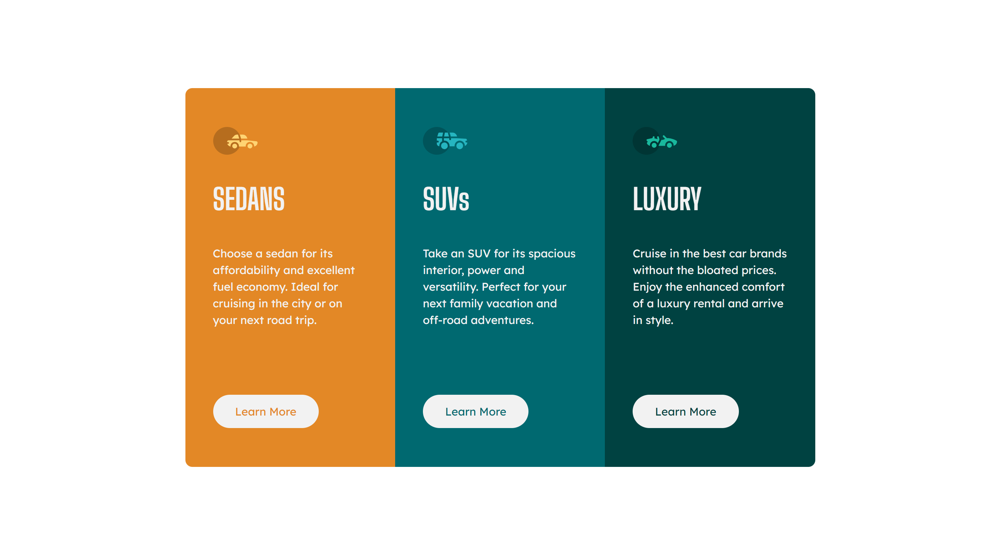

# Frontend Mentor - 3-Column Preview Card Component Solution

## Table of contents

- [Overview](#overview)
  - [The challenge](#the-challenge)
  - [Screenshot](#screenshot)
  - [Links](#links)
  - [Built with](#built-with)
- [Author](#author)

## Overview

### The challenge

Users should be able to:

- View the optimal layout depending on their device's screen size
- See hover states for interactive elements

### Screenshot

| Desktop View                     | Mobile View                    |
| -------------------------------- | ------------------------------ |
|  |  |

### Links

- [Solution URL](https://www.frontendmentor.io/solutions/3columnpreviewcardcomponent-with-styled-components-4nMzb4IIkZ)
- [Auto Junction - Live URL](https://auto-junction.vercel.app)

### Built with

- [React](https://reactjs.org/) - JS library
- CSS Grid
- Flexbox
- Mobile-first workflow

## Author

- Frontend Mentor - [@purrrplelipton](https://www.frontendmentor.io/profile/purrrplelipton)
- Twitter - [@purrrplelipton](https://www.twitter.com/purrrplelipton)
